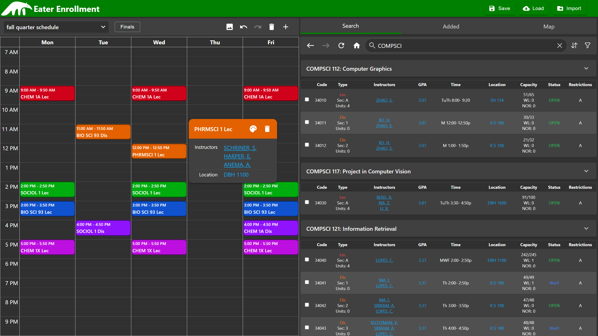

<h1 align="center">Eater Enrollment</h1>
A course scheduler web app that allows students to search for courses and manage class schedules at UCI.
 
The website is currently hosted on Firebase and can be accessed at <a href="https://eaterenrollment.web.app">eaterenrollment.web.app</a>
 
 

<h2>Key Features</h2>
<ul>
  <li><strong>Course Lookup</strong>: Search for courses by department, course number, GE category, or by keyword.</li>
  <li><strong>Search Refinement</strong>: Filter results by numerous criteria such as meeting times and availability.</li>
  <li><strong>Multi-Search</strong>: Toggle multi-search and search for multiple courses at once in a single search.</li>
  <li><strong>Visual Schedules</strong>: Use the integrated calendar to manage schedules that support both added courses and custom events.</li>
  <li><strong>Intuitive Map</strong>: Find where added courses are located on the map with easy-to-read labelled markers.</li>
  <li><strong>Embedded Reviews</strong>: Hover over instructor names to view their RateMyProfessors</li>
  <li><strong>Embedded Grades</strong>: Hover over the GPA column to view average gpa and grades for a course.</li>
</ul>

<h2>Technologies Used</h2>
<h3>Frontend</h3>
<ul>
  <li><strong>React</strong>: JavaScript UI framework.</li>
  <li><strong>FullCalendar</strong>: React calendar component.</li>
  <li><strong>Recharts</strong>: React chart component.</li>
  <li><strong>MUI</strong>: React UI library.</li>
  <li><strong>Leaflet</strong>: Interactive JavaScript map.</li>
  <li><strong>Redux</strong>: State management.</li>
</ul>

<h3>Backend</h3>
<ul>
  <li><strong>PeterPortal API</strong>: API for retrieving UCI course data.</li>
  <li><strong>GraphQL</strong>: Efficient and precise query language.</li>
  <li><strong>Firebase</strong>: Hosting platform for the web app.</li>
  <li><strong>Firestore</strong>: Cloud-based NoSQL database for storing user schedules.</li>
  <li><strong>Firebase Cloud Functions</strong>: Serverless functions used for building APIs.</li>
  <li><strong>tRPC</strong>: End-to-end typesafe API layer.</li>
</ul>